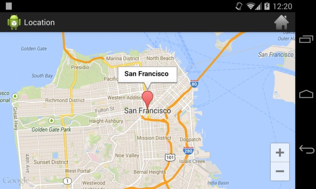
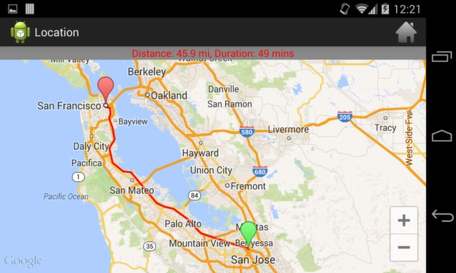

This is practice app I have developed to get hands on different android APIs.
APIs contains Contacts Api, Calendar Api, Google maps and SMS apis with fragments.
Below are some screenshots.

SCREENSHOTS : 

